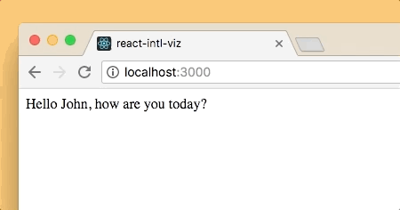

# react-intl-viz

Visualization of i18n-strings for [react-intl](https://github.com/yahoo/react-intl/), inspired by [i18n_viz](https://github.com/railslove/i18n_viz).

**In developoment.**

<p align="center">
  
</p>

## Usage

Instead of importing `FormattedMessage` and `FormattedHTMLMessage` from react-intl, import them from react-intl-viz. You can use those components like their react-intl counterparts.

```js
import React from 'react'
import { IntlProvider } from 'react-intl'
import { FormattedMessage } from 'react-intl-viz'

export default class MyComponent extends React.Component {
  render() {
    return (
      <IntlProvider locale="en" messages={/* ... */}>
        <div className="App">
          <FormattedMessage
            id="app.greeting"
            description="A friendly greeting."
            values={{ name: 'John' }}
          />
        </div>
      </IntlProvider>
    )
  }
}
```

You can find a working App in [/example](example).

## Contribute

1.  Clone repo
2.  `npm install`
3.  `npm link && cd example && npm link react-intl-viz`
4.  Run `npm start` to bundle the library in dev mode
5.  Run `cd example && npm start` in a separate shell to start the example app

## License

[MIT](LICENSE) © 2018 - present Railslove GmbH
